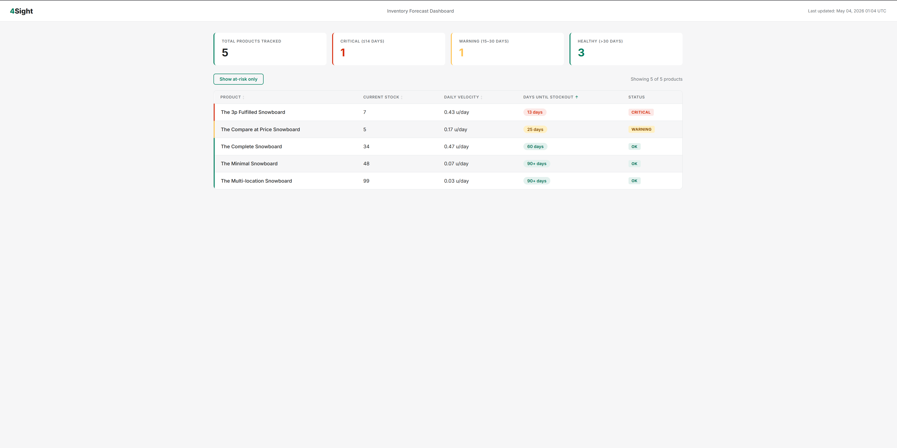

# 4Sight

**Predict when your Shopify products will run out of stock — before they do.**

[](http://foursight-alb-668338117.us-east-1.elb.amazonaws.com)
[](https://www.python.org/)
[](https://www.terraform.io/)
[](https://www.postgresql.org/)
[](LICENSE)

**Live demo:** http://foursight-alb-668338117.us-east-1.elb.amazonaws.com

---


*Dashboard showing products ranked by days until stockout*

---

## What is 4Sight

Shopify shows merchants their current stock, but offers nothing to answer the question that actually matters: *when will I run out?* By the time a product hits zero, the reorder window has already closed and sales are lost.

4Sight installs as a Shopify app and pulls a merchant's product catalog and 30 days of order history through the Admin API. From that history it computes a per-product sales velocity, projects forward against current inventory, and surfaces a single ranked dashboard of which products are closest to stockout.

The result is a triage view: red for products less than two weeks out, orange for the next two weeks, green for everything healthy. A merchant can open the dashboard and know what to reorder this morning without reading a spreadsheet.

---

## Architecture


*AWS infrastructure  (solid borders are live, dashed are planned)*

The web tier (Flask on Fargate behind an ALB) is live on AWS. The scheduled fetcher path (EventBridge → Lambda → SQS → worker) is on the roadmap; today the fetcher and worker run as in-process modules invoked manually.

---

## Tech stack

| Category            | Technology                            |
| ------------------- | ------------------------------------- |
| Backend             | Python 3.12, Flask 3, SQLAlchemy 2    |
| Database            | PostgreSQL 15 (RDS) / 17 (local)      |
| Queue               | Amazon SQS + DLQ *(planned)*          |
| Compute             | ECS Fargate                           |
| Scheduler           | Amazon EventBridge *(planned)*        |
| Email               | Amazon SES *(planned)*                |
| Secrets             | AWS Secrets Manager                   |
| IaC                 | Terraform (`~> 5.0` AWS provider)     |
| Container registry  | Amazon ECR                            |
| Observability       | CloudWatch Logs                       |

---

## Key architecture decisions

- **Lambda for the fetcher, Fargate for the web app.** The fetcher is a short-lived periodic job — Lambda's cold-start and 15-minute ceiling fit it perfectly and cost almost nothing at one invocation per shop per day. The Flask app needs a persistent process for OAuth state and dashboard sessions, so it runs as a long-lived Fargate task.
- **SQS between fetcher and worker.** Decoupling the two means a Shopify API hiccup during fetch doesn't take down the forecast worker, and the DLQ catches poison messages instead of stalling the queue.
- **PostgreSQL over DynamoDB.** The data is relational (`shops → products → orders → forecasts`), the dashboard query is a join, and the upsert into `forecasts` relies on `ON CONFLICT (product_id) DO UPDATE`. Postgres is the cheaper, simpler fit.
- **No Redis.** Forecasts are recomputed once per day and the dashboard reads a few hundred rows per shop. RDS handles the load directly without a cache layer worth maintaining.
- **Daily batch over webhooks.** Webhooks would give near-real-time updates but require persistent endpoint reliability, idempotent handlers, and replay logic. A daily pull is simpler, has predictable cost, and is accurate enough for stockout prediction at the day granularity merchants actually act on.
- **30-day rolling average with a 20% safety factor.** `velocity = sales_last_30d / 30`, then `days_until_stockout = inventory / (velocity * 1.2)`. The safety factor smooths over demand spikes and protects against under-ordering on a hot product.

---

## Local development

**Prerequisites:** Docker, Python 3.12, an `ngrok` URL (for Shopify OAuth callbacks), and a Shopify Partner app with API key + secret.

```bash
git clone https://github.com/ratulkannan-atelier/shopify-inventory-reorder-predictor.git
cd shopify-inventory-reorder-predictor

cp .env.example .env
# Edit .env: set SHOPIFY_API_KEY, SHOPIFY_API_SECRET, SHOPIFY_APP_URL (ngrok)

docker compose up -d                 # Postgres + pgAdmin
python -m venv .venv && source .venv/bin/activate
pip install -r requirements.txt
python run.py                        # http://localhost:5000
```

Install the app on a dev store by visiting `http://localhost:5000/install?shop=<your-store>.myshopify.com`. After OAuth completes, run the fetcher and worker once:

```bash
python -c "from app.fetcher import run_fetcher; run_fetcher()"
python -c "from app.worker import run_worker; run_worker()"
```

Visit `http://localhost:5000/dashboard` to see the forecast. pgAdmin is available at `http://localhost:8080`.

---

## AWS deployment

```bash
cd terraform
terraform init
terraform plan \
  -var="db_password=..." \
  -var="shopify_api_key=..." \
  -var="shopify_api_secret=..." \
  -var="shopify_app_url=http://<alb-dns>"
terraform apply
```

Push the image to ECR (the URL comes from `terraform output ecr_repository_url`):

```bash
aws ecr get-login-password --region us-east-1 | \
  docker login --username AWS --password-stdin <ecr_url>

docker build -t 4sight-app .
docker tag 4sight-app:latest <ecr_url>:latest
docker push <ecr_url>:latest
```

Apply the schema to RDS (run from a host with network access to the private subnets):

```bash
psql "postgresql://reorder_user:<pw>@<rds_endpoint>/reorder_predictor" -f db/schema.sql
```

Force the ECS service to pick up the new image:

```bash
aws ecs update-service --cluster 4sight-cluster --service 4sight-service --force-new-deployment
```

Verify against `http://<alb_dns_name>/health`.

---

## Project structure

```
.
├── app/
│   ├── __init__.py          # Flask application factory
│   ├── config.py            # Reads DATABASE_URL + secrets from env
│   ├── models.py            # SQLAlchemy models (shops, products, orders, forecasts)
│   ├── fetcher.py           # Pulls products + orders from Shopify Admin API
│   ├── worker.py            # Computes sales velocity + days_until_stockout
│   ├── routes/
│   │   ├── main.py          # /health
│   │   ├── auth.py          # /install, /callback (Shopify OAuth)
│   │   └── dashboard.py     # /dashboard (HTML forecast view)
│   └── templates/
│       └── dashboard.html
├── db/
│   └── schema.sql           # Postgres DDL — auto-loaded into Docker volume
├── terraform/               # 11-file AWS deployment (VPC, ECS, RDS, ALB, ...)
├── docker-compose.yml       # Local Postgres + pgAdmin
├── Dockerfile               # python:3.12-slim, runs run.py
├── requirements.txt
└── run.py                   # WSGI entry point
```

---

## What's next

- **EventBridge + Lambda fetcher.** Replace the manual `run_fetcher()` call with a scheduled Lambda that fans out one SQS message per shop.
- **SQS wiring.** Wire the worker as an SQS consumer with a dead-letter queue for poison messages.
- **SES alerts.** Email merchants when a product crosses the 14-day threshold.
- **HTTPS on the ALB.** Add an ACM certificate and redirect 80 → 443.
- **Settings page.** Per-shop thresholds, alert preferences, and a manual "recompute now" button.
- **Webhook support.** Subscribe to `orders/create` and `inventory_levels/update` for sub-daily updates on high-velocity products.

---

## Author

**Ratulkannan** — AWS Solutions Architect Associate + Cloud Practitioner certified.

[GitHub](https://github.com/ratulkannan-atelier)
